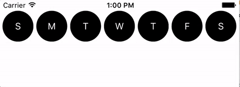
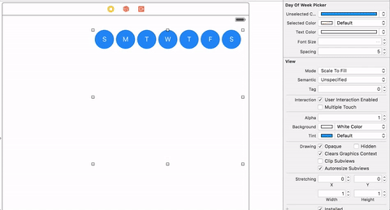
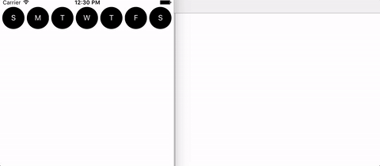

# RZGDayOfWeekPicker

RZGDayOfWeekPicker is an iOS control for selecting days of the week built entirely with Swift



## Installation

To use RZGDayOfWeekPicker simply clone/download this repo and then drag RZGDayOfWeekPicker.swift into your Xcode Project.

## Customizations

* __selectedColor:__ The color that appears when a day of the week is selected
* __unselectedColor:__ The color that appears when a day of the week is not selected
* __textColor:__ The color of the text
* __fontSize:__ The size of the text
* __spacing:__  The spacing between each day



## How to Use 

Create the DayOfWeekPicker either through code or storyboard.

You can then directly interact with the picker using these methods
```swift
func dayIsSelectedAtIndex(index: Int) -> Bool
func indexOfSelectedDays() -> [Int]
func selectDayWithIndex(index: Int)
func deselectDayWithIndex(index: Int)

```

or set your controller to be the pickers delegate to receive messages whenever items are selected or deselected

```swift
override func viewDidLoad() {
    super.viewDidLoad()
    picker.delegate = self
}

func dayWasSelected(picker: RZGDayOfWeekPicker, selectedIndex: Int) {
    print(picker.indexOfSelectedDays())
}

func dayWasDeselected(picker: RZGDayOfWeekPicker, deselectedIndex: Int) {
    print(picker.indexOfSelectedDays())
}

```

